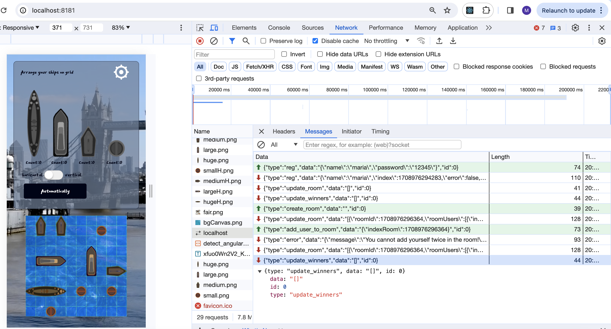
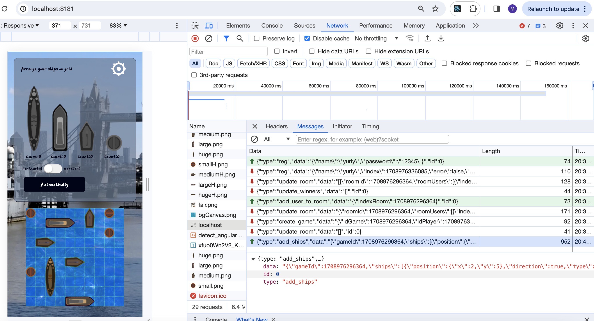

# RSSchool NodeJS websocket Battleship
This is a Battleship game implemented with Node.js websocket API

## Installation
1. Clone/download the repository at https://github.com/mlatysheva/nodejs_websockets-battleship 
2. Run `npm install` to install the dependencies

## Usage
**Development**

- Run `npm run start:dev` to start the game in the development mode

* The app is served @ `http://localhost:8181` with nodemon

**Production**

- Run `npm run start` to start the game in the production mode

* The app is served @ `http://localhost:8181` without nodemon

---

Two players can play the game together using separate web sockets.

The websocket commands of the first player are shown on the screenshot below:

The websocket commands of the second player are shown on the screenshot below:

